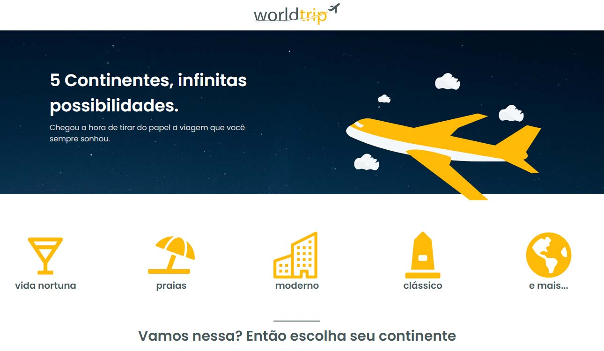

# Ignite Chapter IV

  

  

## Projeto: World Trip

Início Capitulo 4 do ignite foi voltado para uso, da lib do Chakra UI uma lib de componentes. 

O Desafio consistia em desenvolver a aplicação do zero utilizando NextJS e a lib do Chakra, foi disponibilizado o layout no figma. 

Como não queria usar uma simples fakeApi, e já tenho um conhecimento com GraphQl e GraphCms, usei isso para deixar os dados da aplicação lá, em json mesmo. Só pra não poluir a aplicação.

As imagens são imagens do google, então em algum momento alguma pode ficar fora do ar. 

Algumas coisas a mais que fiz além do desafio, foi colocar um modal para visualizar o destino com uma breve descrição do mesmo. Uma pequena animação no início. 
Aproveitei para usar tambem o getStaticProps do NextJS. 

Caso queira ver a aplicação rodando, so entrar aqui
[Link da aplicação](https://world-trip-vince.vercel.app/)

## Tecnologias

 - Next 
 - Chakra
 - Typescript 
 - GraphQl 

### Para a instalação 
Copie o repositório com o git clone #url;
Apos isso execute **yarn** para instalação das dependências;
E então de um **yarn start** para a aplicação rodar no seu Navegador;
Ops: A aplicação não vai funcionar 100% sem os dados em Json. 

### Prints da Aplicação
Todo o layout foi feito pela @RocketSeat 

 
 
 

